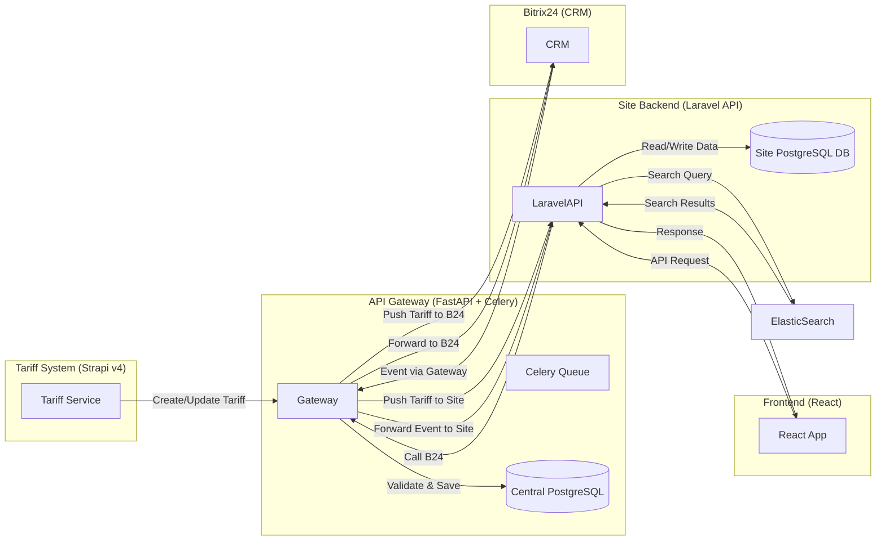

# Архитектурные принципы компании

## Общая архитектура

- Микросервисная архитектура
- Event-driven взаимодействие между системами
- REST API для внешних интеграций
- Асинхронная обработка длительных операций
- Постепенное развертывание (Canary, Blue-Green)

## Компоненты системы

- Tariff System (Strapi v4)
- API Gateway (FastAPI + Celery)
- Central Data Store (PostgreSQL)
- Site Database (PostgreSQL)
- Bitrix24 (CRM)
- Website (React + Laravel API)
- ElasticSearch (поисковый движок)
- Monitoring & Logging (Prometheus, Grafana, Loki)

## Схема взаимодействия

- Frontend и Site Backend взаимодействуют через Laravel API
- Все интеграции с Bitrix24 проходят через API Gateway
- Tariff System отправляет изменения тарифных карт через API Gateway

## Основные сценарии

1. **Работа с тарифами:**

   - Strapi сохраняет тарифную карту → API Gateway валидирует и сохраняет в центральную БД → Gateway трансформирует и отсылает данные в Bitrix24 и на сайт через Laravel API

2. **Поисковый фильтр:**
   - React фронтенд отправляет фильтрационный запрос → Laravel API обогащает и формирует запрос к ElasticSearch → ES возвращает результаты → Laravel API обогащает и отдает фронтенду

## API Gateway (FastAPI + Celery)

- FastAPI для синхронных REST эндпоинтов `/v1/tariff-cards`, `/v1/sync/*`
- Celery для фоновых задач (валидация, маппинг, отправка)
- Конфигурация маппинга сервисов, авторизаций и маршрутов хранится в PostgreSQL

## Безопасность

- Аутентификация сервисов через JWT/OAuth2
- HTTPS для всех коммуникаций

## Масштабируемость и отказоустойчивость

- Горизонтальное масштабирование сервисов
- Кластеризация PostgreSQL с репликацией
- Мониторинг SLA и алёрты через Prometheus и Grafana
