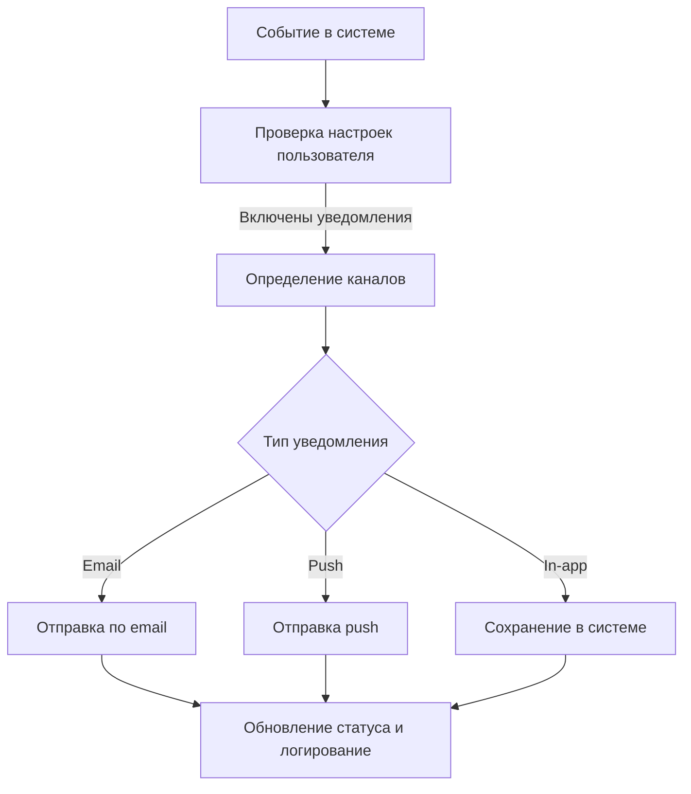

# Бизнес-процессы

## 1. Общие принципы

- Фокус на ценности для пользователя и бизнеса
- Разделение основных и вспомогательных процессов
- Использование стандартизированных нотаций (BPMN, UML)

## 2. Нотация и инструменты

- BPMN 2.0 (Business Process Model and Notation)
- Диаграммы активности (Activity Diagrams)
- Инструменты: Camunda Modeler, Bizagi, Lucidchart

## 3. Этапы работы над бизнес-процессом

1. Сбор и документирование требований
2. Моделирование процесса в BPMN
3. Валидация и согласование с заинтересованными сторонами
4. Оптимизация и анализ узких мест
5. Документирование финального варианта

## 4. Пример: процесс «Управление уведомлениями»

## 5. Рекомендации

- Единообразное именование процессов
- Разбиение сложных процессов на подпроцессы
- Документирование альтернативных и исключительных сценариев
- Указание ответственных ролей и системных участков
