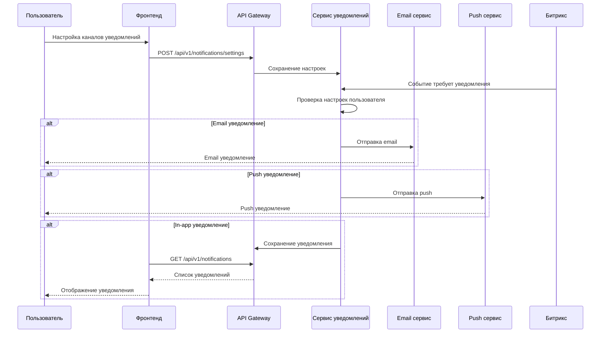
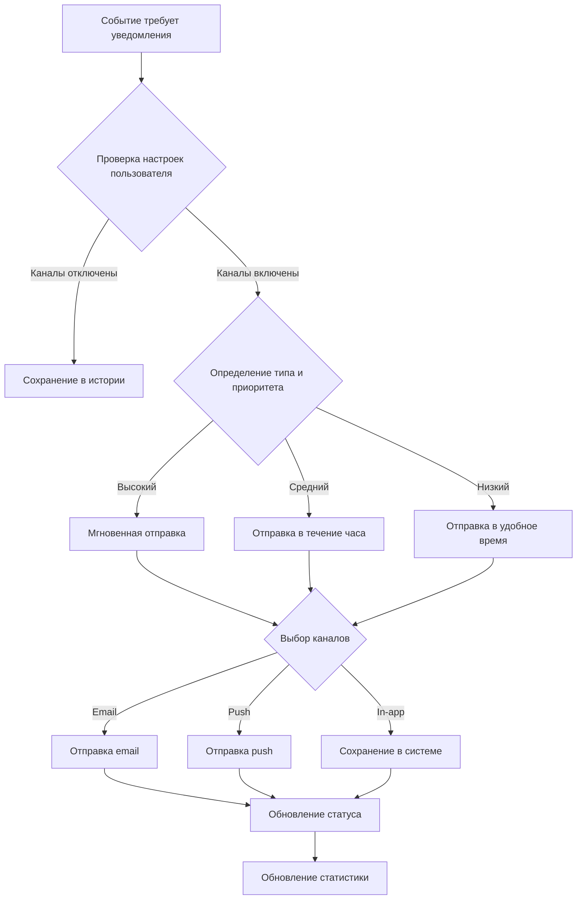
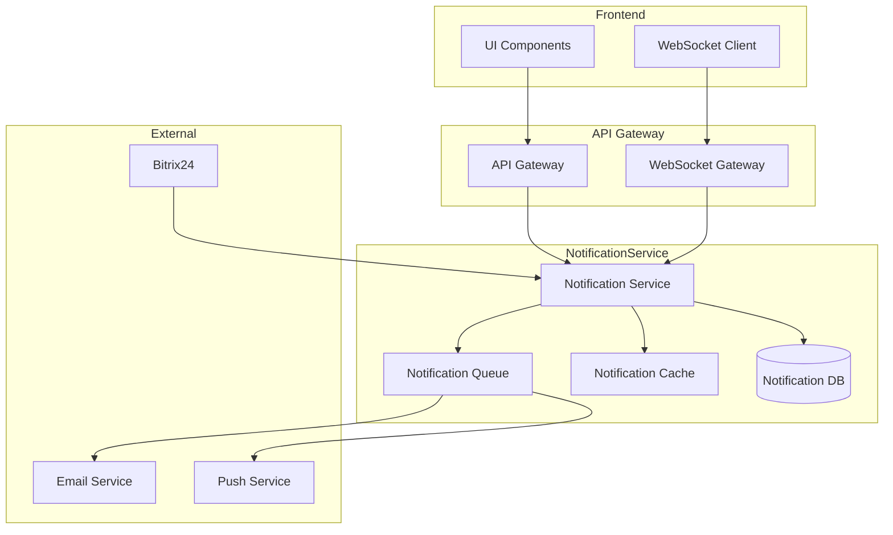

# [БФТ] Система уведомлений пользователей

## **Проблематика:**

В настоящее время пользователи не получают своевременных уведомлений о важных событиях в системе, что приводит к:

- Пропуску важных обновлений и изменений
- Снижению вовлеченности пользователей
- Увеличению количества обращений в поддержку
- Потере потенциальных конверсий

## **Цель:**

Создать единую систему уведомлений, которая будет информировать пользователей о важных событиях через различные каналы коммуникации (email, push, in-app).

## **Польза для бизнеса:**

1. Увеличение retention rate на 15% за счет своевременного информирования
2. Снижение нагрузки на службу поддержки на 20%
3. Повышение конверсии в целевые действия на 10%
4. Улучшение пользовательского опыта и лояльности

## **Польза для юзера:**

1. Мгновенное получение важной информации
2. Выбор предпочтительных каналов коммуникации
3. Контроль над типами получаемых уведомлений
4. Удобный доступ к истории уведомлений

## **Метрики:**

Какие сейчас метрики:

- Среднее время реакции пользователя на событие: 24 часа
- Процент пропущенных важных обновлений: 40%
- Количество обращений в поддержку: 100/день
- Текущий retention rate: 65%

Какие метрики должны измениться и на сколько:

- Среднее время реакции: снижение до 2 часов
- Процент пропущенных обновлений: снижение до 10%
- Обращения в поддержку: снижение до 80/день
- Retention rate: повышение до 80%

## **Background (Product)**

1. Исследование конкурентов:

   - Анализ систем уведомлений в топ-5 конкурирующих продуктах
   - Выявление лучших практик и болевых точек

2. Пользовательские исследования:

   - Проведено 20 интервью с активными пользователями
   - Анализ обратной связи из службы поддержки
   - Исследование паттернов поведения в системе

3. Технический анализ:
   - Оценка существующей инфраструктуры
   - Анализ возможных каналов коммуникации
   - Исследование ограничений платформы

## **AS-IS | TO BE (Product)**

| Как сейчас                                        | Как должно быть                               |
| ------------------------------------------------- | --------------------------------------------- |
| Отсутствует централизованная система уведомлений  | Единая система управления уведомлениями       |
| Уведомления отправляются только по email          | Мультиканальная система (email, push, in-app) |
| Нет возможности управлять настройками уведомлений | Гибкие настройки для каждого типа уведомлений |
| Отсутствует история уведомлений                   | Полная история с поиском и фильтрацией        |
| Нет приоритизации уведомлений                     | Умная приоритизация по важности               |

## **Список User Stories: (Product)**

## **1. User Story: Настроить каналы уведомлений**

| Модуль    | US \ JTBD                                                                                                                             | Критерии приемки                               |
| --------- | ------------------------------------------------------------------------------------------------------------------------------------- | ---------------------------------------------- |
| Настройки | Как пользователь, я хочу настроить предпочтительные каналы получения уведомлений, чтобы получать информацию удобным для меня способом | 1. Доступен выбор каналов: email, push, in-app |
|           |                                                                                                                                       | 2. Можно включить/выключить каждый канал       |
|           |                                                                                                                                       | 3. Настройки сохраняются мгновенно             |
|           |                                                                                                                                       | 4. Есть предпросмотр тестового уведомления     |

## **2. User Story: Управлять типами уведомлений**

| Модуль    | US \ JTBD                                                                                                       | Критерии приемки                              |
| --------- | --------------------------------------------------------------------------------------------------------------- | --------------------------------------------- |
| Настройки | Как пользователь, я хочу выбрать типы уведомлений, которые хочу получать, чтобы не получать ненужную информацию | 1. Список всех типов уведомлений с описаниями |
|           |                                                                                                                 | 2. Возможность включить/выключить каждый тип  |
|           |                                                                                                                 | 3. Группировка по категориям                  |
|           |                                                                                                                 | 4. Быстрые пресеты настроек                   |

## **3. User Story: Просматривать историю уведомлений**

| Модуль  | US \ JTBD                                                                                       | Критерии приемки                              |
| ------- | ----------------------------------------------------------------------------------------------- | --------------------------------------------- |
| История | Как пользователь, я хочу видеть историю всех уведомлений, чтобы не пропустить важную информацию | 1. Список всех уведомлений с датой и временем |
|         |                                                                                                 | 2. Фильтрация по типу и статусу               |
|         |                                                                                                 | 3. Поиск по содержимому                       |
|         |                                                                                                 | 4. Маркировка прочитано/не прочитано          |

## **Элементы интерфейса: (Product)**

### Центр уведомлений:

1. Иконка уведомлений с бейджем непрочитанных
2. Выпадающий список последних уведомлений
3. Кнопка "Показать все"
4. Маркеры статуса уведомлений
5. Кнопка настроек

### Страница настроек уведомлений:

1. Секция каналов связи
2. Секция типов уведомлений
3. Переключатели вкл/выкл
4. Кнопка "Сохранить"
5. Кнопка "Сбросить"

## **Обязательные поля, валидация и сортировка: (Product)**

### Поля формы и их валидация

| Поле            | Тип данных | Обязательный? | Валидация    | Предварительные состояния | Текст подсказка / ошибки    |
| --------------- | ---------- | ------------- | ------------ | ------------------------- | --------------------------- |
| Email           | string     | Да            | Формат email | Пустое                    | "Введите корректный email"  |
| Push-токен      | string     | Нет           | -            | Пустое                    | -                           |
| Тип уведомления | enum       | Да            | Из списка    | Все включены              | "Выберите хотя бы один тип" |

### Поля таблицы и сортировка

| Поле      | Тип данных | Сортировка? |
| --------- | ---------- | ----------- |
| Дата      | datetime   | Да          |
| Тип       | enum       | Да          |
| Статус    | enum       | Да          |
| Заголовок | string     | Да          |

## **Требования к аналитике данных: (Product)**

1. События для отслеживания:

   - Открытие уведомления
   - Изменение настроек
   - Переход по ссылке из уведомления
   - Отключение определенного типа уведомлений

2. Метрики для анализа:

   - CTR уведомлений по типам
   - Время до первого взаимодействия
   - Процент отключения по типам
   - Популярность каналов доставки

3. Отчеты:
   - Эффективность каналов доставки
   - Статистика по типам уведомлений
   - Поведение пользователей
   - Конверсии по каналам

## **Термины и сокращения (Product)**

| Термин, сокращение | Определение, расшифровка                                                                  |
| ------------------ | ----------------------------------------------------------------------------------------- |
| Push-уведомление   | Всплывающее сообщение, отправляемое на устройство пользователя                            |
| In-app уведомление | Уведомление, отображаемое внутри приложения                                               |
| Канал доставки     | Способ отправки уведомления пользователю (email, push, in-app)                            |
| Тип уведомления    | Категория уведомления по его назначению (системное, маркетинговое, транзакционное и т.д.) |
| CTR                | Click-Through Rate - процент переходов по уведомлению                                     |

## **Затрагиваемые платформы: (BA)**

| Платформа     | Затронуто?                                                                |
| ------------- | ------------------------------------------------------------------------- |
| Сайт фронтенд | Да - Добавление UI компонентов для отображения и управления уведомлениями |
| Сайт бэкенд   | Да - Реализация API для работы с уведомлениями                            |
| Битрикс       | Да - Интеграция для отправки уведомлений о событиях CMS                   |
| API Gateway   | Да - Новые эндпоинты для работы с уведомлениями                           |
| Интеграция    | Да - Интеграция с сервисами отправки push и email                         |
| Парсер        | Нет                                                                       |

## **Схема взаимодействия между системами: (BA)**



## **Бизнес логика (BA)**

### Типы уведомлений:

1. **Системные уведомления:**

   - Технические работы
   - Обновления системы
   - Изменения в работе сервиса

2. **Транзакционные уведомления:**

   - Подтверждение действий
   - Статусы операций
   - Важные изменения в системе

3. **Маркетинговые уведомления:**
   - Акции и специальные предложения
   - Новости
   - Персональные рекомендации

### Правила отправки:

1. **Приоритизация:**

   - Высокий приоритет: мгновенная отправка
   - Средний приоритет: отправка в течение часа
   - Низкий приоритет: отправка в удобное время

2. **Группировка:**

   - Объединение похожих уведомлений
   - Ограничение количества уведомлений в единицу времени
   - Умное распределение по времени

3. **Персонализация:**
   - Учет часового пояса пользователя
   - Учет предпочтительного времени получения
   - Адаптация контента под пользователя

## **Бизнес-процесс: (BA)**

### **Схема процесса**



### **Usecase по процессу**

| №   | **Действующее лицо / система** | **Шаг**                                      | **Альтернативный сценарий**           |
| --- | ------------------------------ | -------------------------------------------- | ------------------------------------- |
| 1   | Система                        | Получение события, требующего уведомления    | Событие не требует уведомления        |
| 2   | Система                        | Проверка настроек пользователя               | Пользователь отключил все уведомления |
| 3   | Система                        | Определение типа и приоритета уведомления    | -                                     |
| 4   | Система                        | Проверка ограничений по времени и количеству | Достигнут лимит уведомлений           |
| 5   | Система                        | Выбор каналов доставки                       | Канал недоступен                      |
| 6   | Система                        | Отправка уведомления                         | Ошибка отправки                       |
| 7   | Пользователь                   | Получение уведомления                        | Уведомление не доставлено             |
| 8   | Пользователь                   | Взаимодействие с уведомлением                | Игнорирование уведомления             |
| 9   | Система                        | Обновление статуса и статистики              | Ошибка обновления                     |

## **Синхронизация (BA)**

| Наименование полей | Поля сайта      | Тип данных | Участие в синхре сайт | поля Б24             | Код сущности Б24 | тип данных б24 | Участие в синхре б24 | Поля центральной |
| ------------------ | --------------- | ---------- | --------------------- | -------------------- | ---------------- | -------------- | -------------------- | ---------------- |
| ID уведомления     | notification_id | string     | Да                    | UF_NOTIFICATION_ID   | CRM_TIMELINE     | string         | Да                   | id               |
| Тип уведомления    | type            | enum       | Да                    | UF_NOTIFICATION_TYPE | CRM_TIMELINE     | string         | Да                   | type             |
| Заголовок          | title           | string     | Да                    | UF_TITLE             | CRM_TIMELINE     | string         | Да                   | title            |
| Текст              | content         | text       | Да                    | UF_CONTENT           | CRM_TIMELINE     | string         | Да                   | content          |
| Статус             | status          | enum       | Да                    | UF_STATUS            | CRM_TIMELINE     | string         | Да                   | status           |
| Дата создания      | created_at      | datetime   | Да                    | DATE_CREATE          | CRM_TIMELINE     | datetime       | Да                   | created_at       |
| Дата прочтения     | read_at         | datetime   | Да                    | UF_READ_DATE         | CRM_TIMELINE     | datetime       | Да                   | read_at          |

## **Требования к системному анализу: (SA)**

### **Архитектура**



### **БД схемы**

#### Таблица notifications

```sql
CREATE TABLE notifications (
    id UUID PRIMARY KEY,
    user_id UUID NOT NULL,
    type VARCHAR(50) NOT NULL,
    title VARCHAR(255) NOT NULL,
    content TEXT NOT NULL,
    status VARCHAR(20) NOT NULL,
    priority VARCHAR(20) NOT NULL,
    created_at TIMESTAMP NOT NULL,
    scheduled_at TIMESTAMP,
    sent_at TIMESTAMP,
    read_at TIMESTAMP,
    metadata JSONB,
    CONSTRAINT fk_user FOREIGN KEY (user_id) REFERENCES users(id)
);

CREATE INDEX idx_notifications_user_id ON notifications(user_id);
CREATE INDEX idx_notifications_status ON notifications(status);
CREATE INDEX idx_notifications_created_at ON notifications(created_at);
```

#### Таблица notification_settings

```sql
CREATE TABLE notification_settings (
    user_id UUID PRIMARY KEY,
    email_enabled BOOLEAN DEFAULT true,
    push_enabled BOOLEAN DEFAULT true,
    in_app_enabled BOOLEAN DEFAULT true,
    quiet_hours_start TIME,
    quiet_hours_end TIME,
    notification_types JSONB,
    created_at TIMESTAMP NOT NULL,
    updated_at TIMESTAMP NOT NULL,
    CONSTRAINT fk_user FOREIGN KEY (user_id) REFERENCES users(id)
);
```

#### Таблица notification_templates

```sql
CREATE TABLE notification_templates (
    id UUID PRIMARY KEY,
    type VARCHAR(50) NOT NULL,
    title_template TEXT NOT NULL,
    content_template TEXT NOT NULL,
    metadata_schema JSONB,
    created_at TIMESTAMP NOT NULL,
    updated_at TIMESTAMP NOT NULL
);

CREATE UNIQUE INDEX idx_notification_templates_type ON notification_templates(type);
```

### **API методы**

#### Настройки уведомлений

##### GET /api/v1/notification-settings

**Описание:** Получение настроек уведомлений пользователя

**Параметры запроса:** Не требуются

**Формат ответа:**

```json
{
    "email_enabled": boolean,
    "push_enabled": boolean,
    "in_app_enabled": boolean,
    "quiet_hours_start": "HH:mm",
    "quiet_hours_end": "HH:mm",
    "notification_types": {
        "system": boolean,
        "marketing": boolean,
        "transaction": boolean
    }
}
```

##### PUT /api/v1/notification-settings

**Описание:** Обновление настроек уведомлений

**Тело запроса:**

```json
{
    "email_enabled": boolean,
    "push_enabled": boolean,
    "in_app_enabled": boolean,
    "quiet_hours_start": "HH:mm",
    "quiet_hours_end": "HH:mm",
    "notification_types": {
        "system": boolean,
        "marketing": boolean,
        "transaction": boolean
    }
}
```

#### Управление уведомлениями

##### GET /api/v1/notifications

**Описание:** Получение списка уведомлений

**Параметры запроса:**
| Параметр | Тип | Обязательный | Описание |
|----------|--------|--------------|----------------------------|
| page | int | Нет | Номер страницы |
| per_page | int | Нет | Количество записей |
| type | string | Нет | Фильтр по типу |
| status | string | Нет | Фильтр по статусу |
| from | string | Нет | Начальная дата (ISO 8601) |
| to | string | Нет | Конечная дата (ISO 8601) |

**Формат ответа:**

```json
{
    "items": [
        {
            "id": "uuid",
            "type": "string",
            "title": "string",
            "content": "string",
            "status": "string",
            "created_at": "ISO 8601",
            "read_at": "ISO 8601"
        }
    ],
    "total": integer,
    "page": integer,
    "per_page": integer
}
```

##### POST /api/v1/notifications/{id}/read

**Описание:** Отметить уведомление как прочитанное

**Параметры запроса:** Не требуются

##### DELETE /api/v1/notifications/{id}

**Описание:** Удаление уведомления

**Параметры запроса:** Не требуются

#### WebSocket API

**Endpoint:** /ws/notifications

**События:**

1. Новое уведомление:

```json
{
  "type": "notification",
  "action": "new",
  "payload": {
    "id": "uuid",
    "type": "string",
    "title": "string",
    "content": "string",
    "created_at": "ISO 8601"
  }
}
```

2. Обновление статуса:

```json
{
  "type": "notification",
  "action": "status_update",
  "payload": {
    "id": "uuid",
    "status": "string"
  }
}
```

### **Требования к безопасности**

1. **Аутентификация и авторизация:**

   - Все API-endpoints должны быть защищены JWT-токеном
   - WebSocket соединения должны проходить аутентификацию
   - Проверка прав доступа к уведомлениям

2. **Защита данных:**

   - Шифрование чувствительных данных в БД
   - Использование HTTPS для всех API-запросов
   - Защита от SQL-инъекций
   - Валидация всех входных данных

3. **Ограничения доступа:**
   - Rate limiting для API-запросов
   - Ограничение количества WebSocket соединений
   - Timeout для неактивных соединений

### **Требования к производительности**

1. **Метрики производительности:**

   - Время ответа API: < 200ms для 95% запросов
   - Задержка отправки уведомлений: < 5s для высокого приоритета
   - Максимальное время обработки очереди: < 1 минута

2. **Масштабируемость:**

   - Горизонтальное масштабирование сервисов
   - Кластеризация БД
   - Распределенный кэш

3. **Нагрузка:**
   - Поддержка до 10,000 одновременных WebSocket соединений
   - Обработка до 1,000 уведомлений в секунду
   - Хранение истории уведомлений за последние 6 месяцев
